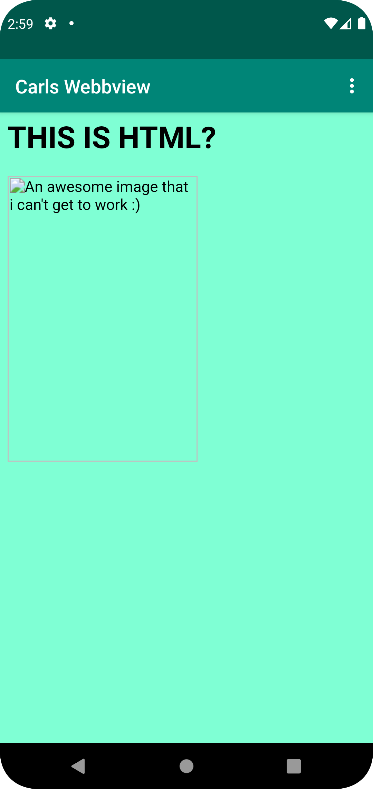
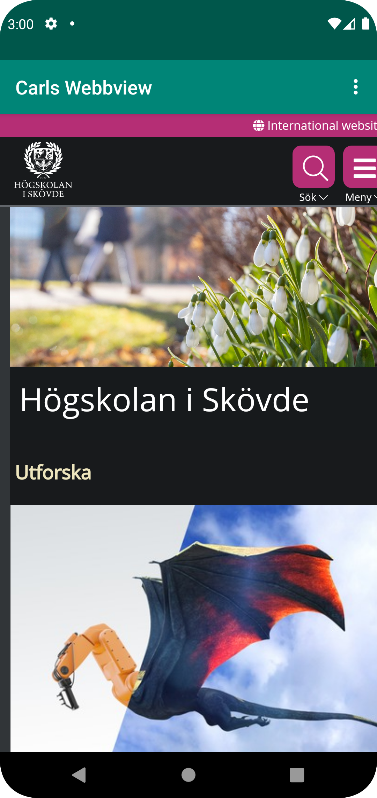

# Rapport
Jag ändrade först värdet på app_name i string.xml till "Carl Webview"
Sedan för att ge Internett access för appen lade jag in ```<uses-permission android:name="android.permission.INTERNET" />``` i AndroidManifest.xml på line 4
Sedan genom activity_main skapades en WebView som tildelades ett ID.
Innuti MainActivity vid methoden onCreate() kopplar vi samman den nya WebViewen till variablen myWebView genom des ID. Jag kopplade en WebViewClient till myWebView och enablade JavaScrips. 
Sen skapade jag en HTML fil och gjorde så att den visas när knappen Internal WebPage trycks, samt att om External WepPage trycks så visar den his.se

```
        myWebView = findViewById(R.id.my_webview);
        client = new WebViewClient();
        myWebView.setWebViewClient(client);
        myWebView.getSettings().setJavaScriptEnabled(true);
        myWebView.loadUrl("file:///android_asset/about.html");
```

Screenshots: Internal WebPage and External WebPage

  
